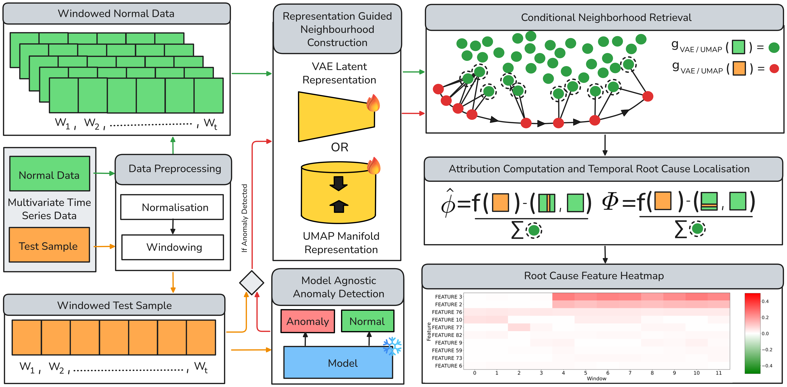

# Conditional Attribution for Root Cause Analysis in Time-Series Anomaly Detection

<p align="center">
  
</p>

<p align="center">
  <a href="https://arxiv.org/abs/2604.17616"></a>
  <a href="#"></a>
  <a href="#"></a>
</p>

Official implementation of **Conditional Attribution (CondAttr)** for **Root Cause Analysis (RCA)** in multivariate time-series anomaly detection.

---

## 🚀 Overview

Anomaly detection tells us **when** something goes wrong.

Root Cause Analysis (RCA) tells us **why**.

Existing explanation methods often rely on unrealistic perturbations that break temporal and cross-feature dependencies, producing unreliable explanations for complex industrial systems.

**CondAttr** introduces a novel **conditional attribution framework** that explains anomalies relative to **contextually similar normal operating states**.

Instead of generating unrealistic counterfactuals, CondAttr retrieves representative normal samples from learned latent manifolds and performs dependency-preserving attribution.

---

## ✨ Key Contributions

* 🔍 Conditional attribution for dependency-preserving explanations
* 🧠 Contextual retrieval using **VAE latent spaces** and **UMAP manifolds**
* ⚙️ Model-agnostic framework compatible with any anomaly detector
* 📈 Novel evaluation metrics:

  * Confidence-Weighted Root Cause Score (**CW-RCS**)
  * Temporal Harmonic Metric (**TemporalHM**)
* 🏭 Extensive evaluation on industrial and distributed-system benchmarks
* 🚀 State-of-the-art root cause localization performance

---

## 🏗️ Architecture

<p align="center">
  
</p>

### Pipeline

1. Train anomaly detector using normal operating data.
2. Learn a compact representation space using:

   * Variational Autoencoder (VAE)
   * UMAP manifold embedding
3. Retrieve contextually similar normal windows.
4. Construct dependency-preserving counterfactuals.
5. Compute conditional attribution scores.
6. Localize root-cause sensors and anomaly onset times.

---

## 🔍 Why Conditional Attribution?

### Traditional Perturbation-Based Methods

❌ Ignore sensor dependencies

❌ Generate out-of-distribution samples

❌ Produce noisy explanations

❌ Fail under highly correlated industrial signals

### CondAttr

✅ Retrieves realistic normal operating states

✅ Preserves temporal and cross-feature dependencies

✅ Generates faithful explanations

✅ Produces actionable root-cause localization

---

## 📊 Main Results

### Root Cause Identification Performance (Top@3 Recall)

| Method            | SWaT      | MSDS      |
| ----------------- | --------- | --------- |
| KernelSHAP        | 0.055     | 0.311     |
| ShaTS             | 0.393     | 0.915     |
| **CondAttr-VAE**  | **0.537** | 0.948     |
| **CondAttr-UMAP** | 0.481     | **0.956** |

---

### Confidence-Aware Evaluation (CW-RCS@3)

| Method            | SWaT      | MSDS      |
| ----------------- | --------- | --------- |
| KernelSHAP        | 0.004     | 0.050     |
| ShaTS             | 0.122     | 0.462     |
| **CondAttr-VAE**  | **0.245** | 0.551     |
| **CondAttr-UMAP** | 0.243     | **0.569** |

---

### Temporal Localization Performance (TemporalHM@3)

| Method            | SWaT      |
| ----------------- | --------- |
| KernelSHAP        | 0.064     |
| ShaTS             | 0.422     |
| CondAttr-VAE      | 0.503     |
| **CondAttr-UMAP** | **0.504** |

---

<!--
## 📁 Repository Structure

```text
CondAttr/
│
├── data/
│
├── models/
│   ├── vae/
│   ├── ae/
│   ├── lstm/
│   ├── tcn/
│   └── transformer/
│
├── retrieval/
│   ├── latent_retrieval.py
│   └── umap_retrieval.py
│
├── attribution/
│   ├── condattr_vae.py
│   └── condattr_umap.py
│
├── evaluation/
│   ├── recall.py
│   ├── cw_rcs.py
│   └── temporal_hm.py
│
├── notebooks/
│
├── assets/
│   ├── architecture.png
│   └── teaser.png
│
├── train.py
├── explain.py
├── evaluate.py
│
└── README.md
```

---

## ⚙️ Installation

Clone the repository:

```bash
git clone https://github.com/<username>/CondAttr.git

cd CondAttr
```

Create environment:

```bash
conda create -n condattr python=3.10

conda activate condattr
```

Install dependencies:

```bash
pip install -r requirements.txt
```

---

## 🧪 Training

Train anomaly detector:

```bash
python train.py \
    --dataset swat \
    --model vae
```

---

## 🔍 Generate Explanations

Run Conditional Attribution:

```bash
python explain.py \
    --dataset swat \
    --method condattr_vae
```

or

```bash
python explain.py \
    --dataset swat \
    --method condattr_umap
```

---

## 📈 Evaluation

Evaluate root-cause localization:

```bash
python evaluate.py
```

Metrics include:

* Top@K Recall
* CW-RCS
* TemporalHM

---
-->

## 📚 Supported Datasets

| Dataset                          | Features    |
| -------------------------------- | ----------- |
| SWaT                             | 51          |
| MSDS                             | 10          |
| Industrial Blast Furnace Dataset | Proprietary |

---

## 🎯 Highlights

* State-of-the-art RCA performance on SWaT
* Strong generalization to distributed systems
* Robust across VAE, AE, LSTM, TCN, and Transformer detectors
* Model-agnostic design
* Industrially validated on blast furnace monitoring systems

---

## 📦 Code Release Status

The paper has been accepted at **ECML-PKDD 2026**.

We are currently cleaning and documenting the codebase.

The following will be released soon:

* Source code
* Trained models
* Reproducibility scripts
* Evaluation pipeline
* Benchmark configurations

Stay tuned!

---

## 📧 Early Access

The repository is currently under preparation.

For questions, collaborations, or early access to the code and pretrained models, please contact:

**Shashank Mishra**

📩 [shashank.mishra@dfki.de](mailto:shashank.mishra@dfki.de)

---

## 📖 Citation

If you find this work useful in your research, please cite:

```bibtex
@article{mishra2026conditional,
  title={Conditional Attribution for Root Cause Analysis in Time-Series Anomaly Detection},
  author={Mishra, Shashank and Patil, Karan and Schockaert, Cedric and Stricker, Didier and Rambach, Jason},
  journal={arXiv preprint arXiv:2604.17616},
  year={2026}
}
```

---

## ⭐ Star the Repository

If you find this work useful, please consider giving the repository a star.

It helps increase visibility and supports future research.
